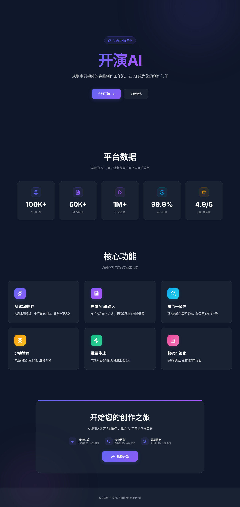

<div align="center">


# 🎬 开演AI | KaiyanAI

### **AI-Powered Content Creation Platform for Filmmakers**

**专为影视创作者打造的AI内容创作平台**

*From Script to Screen, Powered by AI*

[](https://github.com/your-org/kaiyan-tool/stargazers)
[](https://github.com/your-org/kaiyan-tool/network/members)
[](https://opensource.org/licenses/MIT)
[](https://nodejs.org/)
[](https://www.typescriptlang.org/)
[](CONTRIBUTING.md)

**[🚀 Live Demo](#)** · **[📖 Documentation](./docs)** · **[🐛 Report Bug](https://github.com/your-org/kaiyan-tool/issues)** · **[✨ Request Feature](https://github.com/your-org/kaiyan-tool/issues)**

---

</div>

## 🌟 Why KaiyanAI? | 为什么选择开演AI?

<table>
<tr>
<td width="50%">

### English

**KaiyanAI** revolutionizes content creation by integrating the entire filmmaking workflow into one powerful platform. From scriptwriting to video production, our AI-powered tools help creators bring their stories to life faster than ever.

**Key Highlights:**
- 🎯 **All-in-One Solution** - Script, storyboard, images, and video in one place
- 🤖 **AI-Powered** - Smart parsing, generation, and optimization
- ⚡ **Lightning Fast** - Generate storyboards in seconds, not hours
- 🎨 **Professional Quality** - Cinema-grade output for your projects

</td>
<td width="50%">

### 中文

**开演AI** 将影视创作全流程整合到一个强大的平台中。从剧本创作到视频制作，我们的AI工具帮助创作者更快地将故事变为现实。

**核心优势：**
- 🎯 **一站式解决方案** - 剧本、分镜、图像、视频一站式完成
- 🤖 **AI驱动** - 智能解析、生成和优化
- ⚡ **极速创作** - 秒级生成分镜，告别繁琐工作
- 🎨 **专业品质** - 电影级输出质量

</td>
</tr>
</table>

---

## ✨ Features | 功能特性

<table>
<tr>
<td width="33%" valign="top">

### 📝 Script Writing
### 剧本创作


- Monaco Editor with syntax highlighting
- AI-powered scene parsing
- Smart character detection
- Template library

**Monaco编辑器**
- AI场景解析
- 角色智能识别
- 丰富模板库

</td>
<td width="33%" valign="top">

### 🎬 Shot Panel
### 分镜系统


- Auto-generate from script
- 9-grid visual layout
- Drag & drop reorder
- AI prompt optimization

**一键生成分镜**
- 九宫格可视化
- 拖拽排序
- 提示词优化

</td>
<td width="33%" valign="top">

### 🎨 Image & Video
### 图像与视频


- Multi-AI provider support
- Batch image generation
- Video from keyframes
- Multi-format export

**多AI提供商**
- 批量图像生成
- 关键帧生成视频
- 多格式导出

</td>
</tr>
</table>

---

## 🎥 Demo | 演示

<div align="center">

| Dashboard | Script Editor | Shot Panel |
|:---------:|:-------------:|:----------:|
|  |  |  |
| *主界面* | *剧本编辑器* | *分镜面板* |

| Character Management | Image Generation | Video Export |
|:-------------------:|:----------------:|:------------:|
|  |  |  |
| *角色管理* | *图像生成* | *视频导出* |

</div>

---

## 🚀 Quick Start | 快速开始

### Prerequisites | 环境要求

```bash
Node.js >= 24.0.0    # JavaScript runtime
Docker & Compose     # Containerization
PostgreSQL 16        # Database
Redis 7+             # Cache & Queue
```

### Installation | 安装

```bash
# Clone the repository | 克隆仓库
git clone https://github.com/your-org/kaiyan-tool.git
cd kaiyan-tool

# Setup environment | 配置环境
cp .env.example .env
# Edit .env with your settings | 编辑.env配置

# Start with Docker | Docker启动
docker-compose up -d --build

# Access the app | 访问应用
# Web: http://localhost:3000
# API: http://localhost:3001
```

### Development | 本地开发

```bash
# Install dependencies | 安装依赖
npm install

# Start databases | 启动数据库
docker-compose up postgres redis -d

# Run migrations | 运行迁移
cd apps/api && npx prisma migrate dev

# Start API (Terminal 1) | 启动API
cd apps/api && npm run dev

# Start Web (Terminal 2) | 启动前端
cd apps/web && npm run dev
```

---

## 🏗️ Architecture | 技术架构

<div align="center">

| Layer | Technology |
|:-----:|:----------:|
| **Frontend** | React 18 · TypeScript · Vite · Monaco Editor |
| **Backend** | Node.js 24 · Express · TypeScript |
| **Database** | PostgreSQL 16 · Prisma ORM |
| **Cache** | Redis 7 · Bull Queue |
| **AI** | OpenAI · Google AI · 智谱AI · AntSK |
| **Deploy** | Docker · Docker Compose |

</div>

```
kaiyan-tool/
├── 📂 apps/
│   ├── 🔌 api/          # Backend API service
│   │   ├── controllers/ # Request handlers
│   │   ├── services/    # Business logic
│   │   ├── agents/      # AI agents
│   │   └── prisma/      # Database schema
│   │
│   └── 🌐 web/          # Frontend application
│       ├── pages/       # Page components
│       ├── components/  # UI components
│       └── hooks/       # Custom hooks
│
├── 📚 docs/             # Documentation
└── 🐳 docker-compose.yml
```

---

## 🤝 Contributing | 贡献指南

We love contributions! Whether it's bug reports, feature requests, or code contributions.

我们欢迎所有形式的贡献！无论是问题反馈、功能建议还是代码贡献。

<a href="https://github.com/your-org/kaiyan-tool/graphs/contributors">
  
</a>

### Ways to Contribute | 贡献方式

- 🐛 **Report Bugs** - Submit issues for any bugs you find
- 💡 **Suggest Features** - Share your ideas for new features
- 🔧 **Submit PRs** - Contribute code improvements
- 📖 **Improve Docs** - Help make our documentation better

```bash
# Create a feature branch
git checkout -b feature/amazing-feature

# Commit your changes
git commit -m "✨ Add amazing feature"

# Push to the branch
git push origin feature/amazing-feature

# Open a Pull Request
```

---

## 📊 Roadmap | 发展路线

- [x] Script editor with AI parsing
- [x] Character management system
- [x] AI-powered shot generation
- [x] Multi-provider image generation
- [x] Video export functionality
- [ ] Real-time collaboration
- [ ] Mobile app support
- [ ] Cloud deployment templates
- [ ] Plugin system

---

## 📄 License | 许可证

This project is licensed under the **MIT License** - see the [LICENSE](LICENSE) file for details.

本项目采用 **MIT 许可证** - 详情请查看 [LICENSE](LICENSE) 文件。

---

## 🙏 Acknowledgments | 致谢

- [OpenAI](https://openai.com/) - GPT & DALL-E APIs
- [Google AI](https://ai.google/) - Imagen API
- [智谱AI](https://www.zhipuai.cn/) - CogView API
- All our amazing contributors ⭐

---

<div align="center">

## ⭐ Star History

[](https://star-history.com/#your-org/kaiyan-tool&Date)

---

### 🌟 If you find this project helpful, please consider giving it a star!

### 🌟 如果这个项目对你有帮助，请给我们一个星标！

**Made with ❤️ by KaiyanAI Team**

[⬆ Back to Top](#-开演ai--kaiyanai)

</div>
